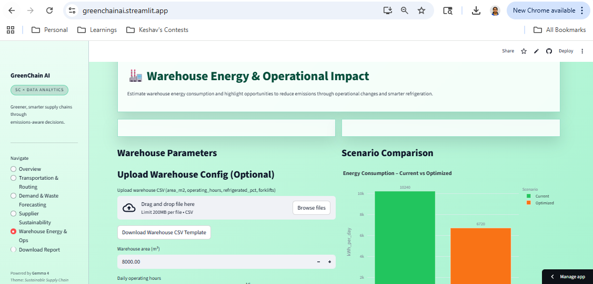
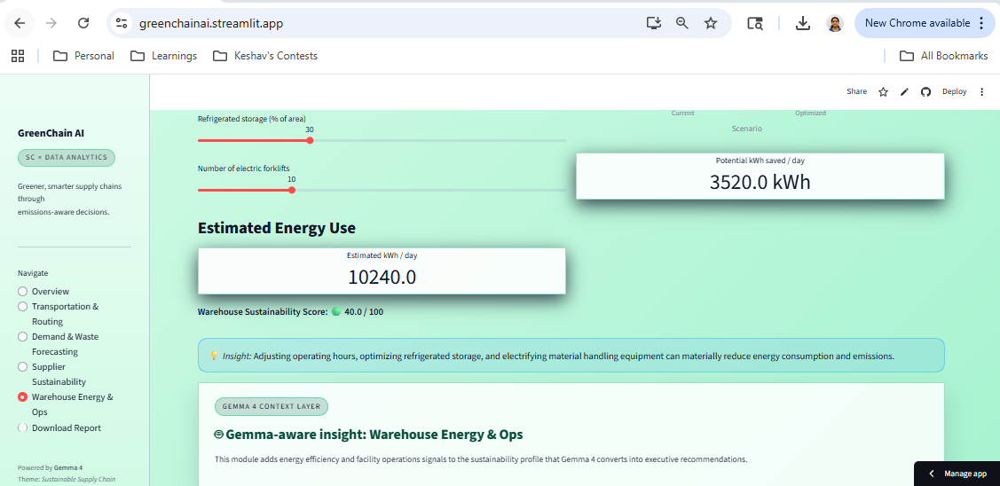
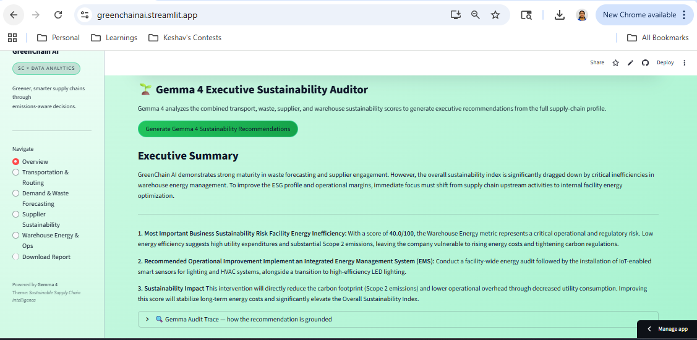

 **GreenChain AI — Gemma-Powered Sustainability Intelligence for Resilient Supply Chains**
**Author:** Kiruthikaa Natarajan Srinivasan  
 

**Live App:** [https://greenchainai.streamlit.app](https://greenchainai.streamlit.app)
**Powered By:** Gemma 4 + Streamlit + Python
**Repository:** [https://github.com/Kiruthikaa2512/Greenchain_AI](https://github.com/Kiruthikaa2512/Greenchain_AI)


**Project Overview:**
GreenChain AI is a unified sustainability intelligence platform designed to evaluate the environmental impact of end-to-end supply chain operations in real time. It converts route emissions, demand planning accuracy, supplier ESG maturity, and warehouse energy usage into a single, interpretable sustainability index (0–100).
The goal: **help businesses make greener, smarter, and more responsible supply-chain decisions.**

---

## **1. Overview**

Global supply chains are responsible for over 60% of worldwide emissions. Organizations lack accessible, decision-ready tools that make sustainability *measurable*, *actionable*, and *transparent*.

GreenChain AI solves this problem by providing:

* Real-time routing emissions estimates
* Demand forecasting with overstock/waste impact
* Supplier sustainability benchmarking
* Warehouse energy efficiency modeling
* A consolidated Sustainability Index

The platform is designed to be understandable even to users without technical supply chain knowledge.

---

## **2. Features**

### **A. Overall Sustainability Dashboard**

Centralized score combining the four core pillars:

* Transport Sustainability Score
* Waste & Forecasting Score
* Supplier Sustainability Score
* Warehouse Sustainability Score

Includes a **radar chart** to visually understand strengths and weaknesses across supply chain operations.

---

### **B. Transportation & Routing**

Model the environmental impact of last-mile delivery.

**Capabilities:**

* Upload real route data via CSV
* Or auto-generate synthetic routes
* Vehicle comparison (Diesel, Gasoline, Hybrid, Electric)
* Load-factor sensitivity
* Emissions vs. baseline diesel
* Automatic route optimization using nearest-neighbor heuristics

**CSV Template Columns:**

```
location, latitude, longitude, drop_kg
```

---

### **C. Demand & Waste Forecasting**

Evaluate inventory waste based on forecasting and planning decisions.

**Capabilities:**

* Upload demand history or generate synthetic data
* Automatic linear regression forecast
* Adjustable safety stock factor
* Overproduction/waste estimation
* Waste Sustainability Score (0–100)

**CSV Template Columns:**

```
date, demand
```

---

### **D. Supplier Sustainability**

Quantify supplier performance using weighted ESG dimensions.

**Capabilities:**

* Upload supplier data via CSV
* Weighted scoring across:

  * On-time Delivery
  * ESG Score
  * Quality Score
  * Emission Transparency
* Radar chart view for any selected supplier
* Computes weighted Supplier Sustainability Score

**CSV Template Columns:**

```
supplier, on_time_delivery, esg_score, quality_score, emission_transparency
```

---

### **E. Warehouse Energy & Operations**

Model energy consumption and identify optimization opportunities.

**Capabilities:**

* Upload warehouse parameters
* Model refrigeration impact
* Forklift count impact
* Operating hours modeling
* Optimized scenario comparison
* Warehouse Sustainability Score

**CSV Template Columns:**

```
area_m2, operating_hours, refrigerated_pct, forklifts
```

---

### **F. PDF & Text Sustainability Report**

Automatic downloadable sustainability summary including:

* All scores
* Overall sustainability index
* Module-wise results

---

## **3. Tech Stack**

### **Framework**

* **Streamlit** — lightweight, fast UI for data applications

### **Languages**

* Python 3.9+

### **Core Libraries**

* **Pandas, NumPy** — Data processing
* **Plotly** — Interactive charts
* **scikit-learn** — Forecasting
* **NetworkX** — Routing logic
* **ReportLab** — PDF generation

### **Deployment**

* **Streamlit Cloud** — Direct GitHub integration

---
## **4. Gemma 4 Integration**

GreenChain AI integrates the Gemma 4 model through the Google GenAI API to transform operational sustainability metrics into executive-style sustainability recommendations.

Rather than displaying raw sustainability scores alone, Gemma 4 interprets transportation emissions, supplier ESG metrics, warehouse efficiency indicators, and waste forecasting outputs to generate actionable operational insights.

### Gemma 4 Capabilities Used

- Sustainability recommendation generation
- Operational reasoning from structured metrics
- Executive-level natural language summaries
- AI-assisted decision support

### Example Workflow

1. User uploads or generates sustainability data
2. GreenChain AI computes operational sustainability metrics
3. Gemma 4 analyzes the aggregated sustainability profile
4. Executive recommendations are generated in real time

A local fallback recommendation system is also included to ensure graceful degradation during API latency or service interruptions.

## **5. Why This Matters**

Most sustainability tools in supply chain analytics are:

* Expensive
* Over-engineered
* Not accessible to small businesses
* Not actionable for day-to-day decisions

GreenChain AI delivers:

* Transparency
* Actionability
* Interpretability for non-technical users
* Immediate value with simple inputs
* A unified sustainability measurement framework

This democratizes sustainability analytics for both small and large organizations.

---

## **6. Real-World Impact**

GreenChain AI was designed to demonstrate how AI-powered sustainability analytics can support operational resilience and climate-conscious logistics decision-making.

The platform helps organizations:
- identify high-emission operational areas,
- reduce avoidable transportation waste,
- improve supplier sustainability visibility,
- optimize warehouse energy efficiency,
- and transform fragmented sustainability metrics into actionable operational intelligence.

By combining sustainability analytics with Gemma 4 reasoning, GreenChain AI demonstrates how AI can support more responsible and resilient global supply chains.

## **7. Installation & Local Execution**

### **Clone the repository**

```bash
git clone https://github.com/Kiruthikaa2512/Greenchain_AI.git
cd Greenchain_AI
```

### **Create Virtual Environment**

```bash
python -m venv venv
source venv/bin/activate      # macOS/Linux
venv\Scripts\activate         # Windows
```

### **Install Dependencies**

```bash
pip install -r requirements.txt
```

### **Run the App**

```bash
streamlit run app.py
```

---

## **8. CSV Templates**

Templates are included to help users understand expected formats.

**Route Template:** `templates/route_template.csv`
**Demand Template:** `templates/demand_template.csv`
**Supplier Template:** `templates/supplier_template.csv`
**Warehouse Template:** `templates/warehouse_template.csv`

(All available for download inside the app too.)

---

## **9. Architecture**

User Inputs / CSV Uploads
        ↓
GreenChain Analytics Engine
        ↓
Sustainability Scoring Modules
        ↓
Gemma 4 Recommendation Layer
        ↓
Executive Sustainability Insights
        ↓
PDF Report Generation

```
├── app.py
├── requirements.txt
├── templates/
│   ├── route_template.csv
│   ├── demand_template.csv
│   ├── supplier_template.csv
│   └── warehouse_template.csv
├── screenshots/
│   ├── overview.png
│   ├── routing.png
│   ├── forecasting.png
│   ├── supplier.png
│   └── warehouse.png
└── README.md
```

## **10. Screenshots**

### Overview Dashboard


### Transportation & Routing


### Demand & Waste Forecasting


### Warehouse Energy Operations



### Download Report


### Gemma 4 Executive Sustainability Auditor


---

## **11. What Was Hard**

* Building a unified scoring model that feels intuitive
* Ensuring CSV uploads gracefully handle errors
* Balancing realism vs. simplicity for hackathon constraints
* Designing UI/UX that works for non-technical users
* Managing multiple modules without overwhelming the interface

---

## **12. What Surprised Me**

* How well simple forecasting models work for waste prediction
* How emissions change drastically based on small routing decisions
* How sustainability decision-making becomes more actionable when operational data is visualized clearly.

---

## **13. Future Roadmap**

* AI-powered route optimization
* Real-time CO₂ emission APIs
* Multi-warehouse planning
* Blockchain-based supplier audit traceability
* Enterprise integration (ERP/SRM systems)
* Custom scoring weights per industry

---

## **14. License**

MIT License.

